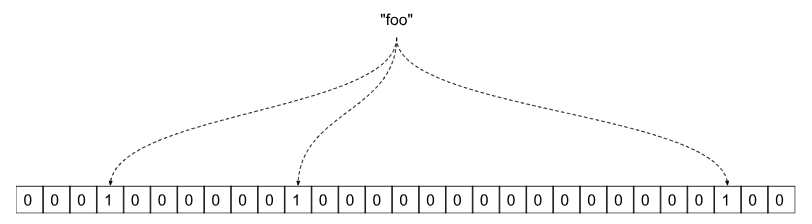
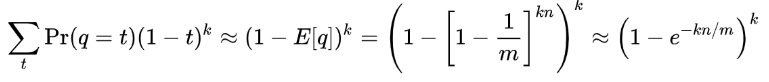

# Bloom Filters

<!--- The assignment is available [here](https://docs.google.com/document/d/1oemB381C-Fqw8Ij28HJCCoIQdxgV_qF4AJ8rfYljrCQ/edit?usp=sharing). --->


## Motivation

A [hash table](https://www.hackerearth.com/practice/data-structures/hash-tables/basics-of-hash-tables/tutorial/) is great to find out whether an element is part of a set. Unfortunately, it also comes at the cost of storage. Hash tables work well when the table is sparsely populated, which means you need a big array to hold it.

A Bloom filter is a space efficient data structure that allows you to test whether an element is part of a set. When you query a bloom filter, it can answer in one of two ways:


1. The element is **definitely not** in the set, or
2. The element **might be** in the set.

This behavior is suitable for scenarios where elements are much more likely not to be in the set. For example, Google Chrome uses a Bloom filter to test for malicious URLs. There are a large set of malicious URLs, but there is an even larger set of non-malicious ones. In Chrome's case, it wants to very quickly determine whether a URL is non-malicious, to speed up the common case. The Bloom filter can quickly tell when a URL is non-malicious, and in some percentage of cases, you will get a possible existence. Since some of these are correct and some are false positives, this will require actually checking the database. A well designed Bloom filter will dramatically reduce the need to check the database for most non-malicious URLs. For other uses of Bloom Filters, check this [link](https://en.wikipedia.org/wiki/Bloom_filter).


## Data Structure



Figure 1. A Bloom filter with a bit array showing the word "foo" hashed to three locations.

A Bloom filter is represented by an array of _m_ bits. All bits in the array are initially set to 0.

When an element is added to the bloom filter, it is hashed _k_ times, each using a different hash function. The figure above shows the word "foo" hashed with 3 different hash functions.  The hash values correspond to locations in the bit array. Each location in the bit array is set to 1.

When querying the Bloom filter for an element, we again generate _k_ hashes. We check each location in the bit array that the hashes map to. If any of the locations is 0, we know for sure that the element is **definitely not** in the set. If all the hashed locations are 1, then the element **might be** in the set. We cannot tell for sure, since other elements may have caused the bit locations to be set.

A Bloom filter doesn't hold the elements themselves. A secondary storage source is used to actually hold those elements.


## Performance

A Bloom filter can hold an arbitrarily large number of elements, but as you expect, as more items are added, the false positive rate goes up steadily as more 1s are set in the bit array. If you are interested, the exact probability of false positives is





A Bloom filter with a 1% error rate and an optimal number of _k _hashes uses approximately [9.6 bits per element](https://en.wikipedia.org/wiki/Bloom_filter#:~:text=Linked%20structures%20incur%20an%20additional,the%20size%20of%20the%20elements.). This is pretty good, when you consider that a single Java reference is 64 bits.


## Your Tasks

Your task is to implement the BloomFilter class. You are given a Hash class in Hash.java that you must use. The Hash class gives you a hash function that the autograded tests will also use.

You need to implement:


* **public BloomFilter(int size, int numHashes)** - Create a Bloom filter with size number of bits, and the given number of hash functions to use. The filter must store the bit array in an array of bytes.
* **public byte[] getBytes()** - Return the byte array that is used by the filter.
* **public void add(String s)** - Add the string s to the filter, updating the byte array as necessary. 
* **public boolean getBit(int pos)** - Return true if the bit at the given position is set to 1, or false otherwise.
* **public boolean lookup(String s)** - Return true if the string s is potentially present in the set, or false if the string s is definitely not present.


### Example 

Let's assume that the filter size is 20. There are therefore `ceil(20.0/8) = 3` bytes used to represent a filter of size 20. The last four bits of byte 2 are not used, and thus grayed out in the figure below.  

Now assume that there are three hashes, one to position 5, one to position 13 and one to position 19. The figure below shows the bits that are set in the byte array. 


You have to use [bit masking operations in Java](https://www.google.com/search?q=bit+masks+in+Java&oq=bit+masks+in+Java) to accomplish setting and unsetting bits. 

Hint: 


* Find the correct byte, then 
* Bit mask the correct bit in the byte.


## Testing

There is a small test program in main in BloomFilter.java. You can compile and run it with:
```
	make run
```
You can test your code with
```
	make test
```

## Submitting
Submit your source .java files to this repo.
